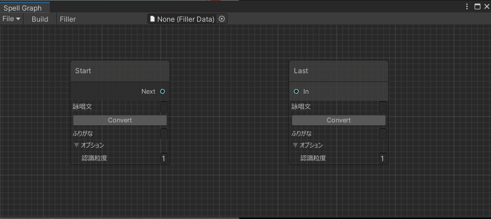
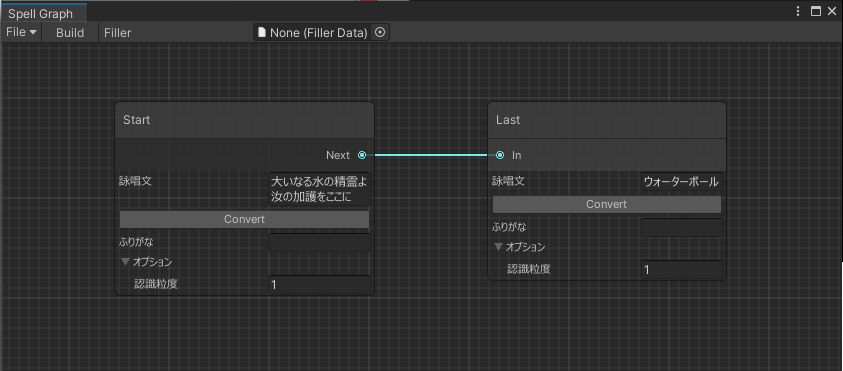
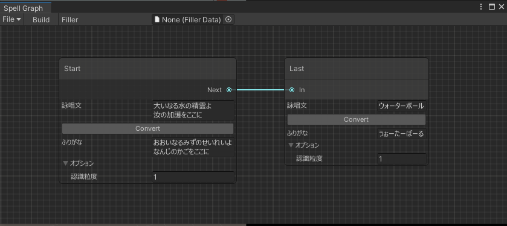
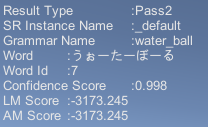
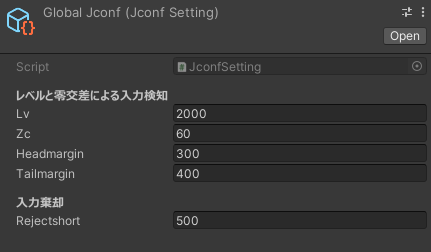

# UniJulius
UniJuliusは、[汎用大語彙連続音声認識エンジンJulius](https://github.com/julius-speech/julius)をUnityで使用するためのライブラリです。　\
魔法詠唱のような長文の発話認識結果を逐次的に取得するために開発しました。  \
そのため、元のJuliusの仕様に加えて、Spellという独自の認識単位があります。

またエディター拡張により、Juliusの動作に必要な設定ファイルの構築を、Unity Editor上のみで行なえます。 

紹介動画\
https://user-images.githubusercontent.com/37218752/125793268-5efc6c71-7606-4420-894b-e5ffbbfd4db7.mp4

# 対応プラットフォーム
- Windows x64

# 動作環境
- エディター拡張による設定ファイルの構築をする場合
    - Unity2019.1 or later (UI Elementsを使用しているため)
- 音声認識のみを行う場合
    - 未調査、だいたい動くと思う

# Juliusの仕様
Juliusの音声認識は主に以下の要素から成り立ちます。\
詳細は[The Julius Book](http://julius.osdn.jp/juliusbook/ja/index.html)を参照
- 認識処理インスタンス(SR)
    - 言語インスタンス(LM)
        - 文法(Grammar)
            - 辞書ファイル(*.dict)
            - 文法ファイル(*.dfa) 
    - 音響インスタンス(AM)
        - HMM定義ファイル
        - HMMListファイル

基本的には言語インスタンスの文法を操作することになります。

# Getting started
Juliusでは文法認識や自由発話認識は別として、音声認識に*.jconfと*.dictというファイルを必要とします。
1. Unity Editorを起動し、UniJulius.unitypackageをインストールします。
1. ヘッダーの`Window->UniJulius->Open Spell Container Graph`をクリックすると下図のようなウィンドウが開きます。

1. 詠唱文と認識粒度を記入し、ノード間をつなぎます。\
詠唱文の仕様及び認識粒度についての詳しい内容は[Spell Graph](#Spell-Graph)を参照してください。

1. Convertボタンを押し、ひらがなに変換します。\
注：変換がうまく行かない場合があるので、その際は人手で修正してください。

1. ヘッダーの`File->Save`ボタンからScriptableObjectとして保存します。 \
(デフォルトでは`Assets/UniJulius/Resources/SpellContainers`ディレクトリ内に保存されます。) 
1. その後ヘッダーのBuildボタンを押すことで、音声認識に必要なjconfファイルとdictファイルが`Assets/StreamingAssets/UniJulius/UserConfig/SpellName/`ディレクトリ内に保存されます。
1. 適当なスクリプトファイルを作成し、以下のようなコードを書きましょう。
```c#
using System.Collections.Generic;
using UnityEngine;
using UniJulius.Runtime;

namespace UniJulius.Sample
{
    public class UniJuliusSample : MonoBehaviour
    {
        [SerializeField] private SpellContainer spellContainer;
        private string resultString;
        
        private void Start()
        {
            UniJuliusCore.ResultReceived += OnResultReceived;
            UniJuliusCore.Init(true);
            UniJuliusCore.Begin(spellContainer);
        }
        
        private void OnResultReceived(List<RecognitionResult> results)
        {
            resultString = "";
            foreach (var parsedResult in results)
            {
                resultString += parsedResult + "\n";
            }
        }

        private void OnGUI()
        {
            GUI.Label(new Rect(0, 0, Screen.width, Screen.height), resultString);
        }

        private void OnDestroy()
        {
            UniJuliusCore.Finish();
        }
    }
}
```
1. 上記スクリプトを適当なシーンオブジェクトにアタッチし、インスペクターの`spellContainer`に先程作成したSpellContainerのScriptableObjectをアタッチしましょう。
1. Playボタンを押すことで、音声認識が始まり、認識結果がGameビューに表示されます。\
[](認識結果の詳細は[RecognitionResult](#RecognitionResult)を参照してください)


# Isolated Word　Window
Julius標準の孤立単語認識のための辞書ファイルを生成します。\
ひらがなのみを入れてください。ひらがな以外を入れて音声認識を実行するとエラーが発生します。

# Spell Graph
## 名称
保存時に付けたファイル名がそのまま詠唱の名称になります。\
認識結果の`RecognitionResult.GrammarName`で取得できる文法名がここで設定した名称になります。

## 詠唱文
詠唱文に記入できるのは全角文字のみです。\
Convertボタンによるかな変換では、全角文字以外は除外しており、全角文字で変換できないものはそのままにしてあります。\
また詠唱文内の空白文字はConvertボタンを押したときにすべて削除するようになっています。

改行を行うことで、改行前の文字列と改行後の文字列は別の詠唱として認識されます。

## 認識粒度
認識粒度は、詠唱文をどこで区切って認識するかの単位です。\
認識粒度が3のとき、「大いなる水の精霊よ」では「大いな/る水の/精霊よ」のように区切られ、その単位で認識されます。\
具体的には、「大いなる水」まで発音した場合、認識結果は「大いな」か「大いなる水の」のどちらかになります。\
Julius上では「大いな」「大いなる水の」「大いなる水の精霊よ」のような単語が定義されています。

現在ビルドしてあるjulius-native.dllで使用可能な単語数は65535であり、これ以上の単語数は認識できません。\
この上限はビルド時にJulius側の設定を書き換えることで変えられます。

## Edge
Spell Node同士はEdgeで連結することができますか、現状は特に意味はありません。\
今後、詠唱をこのEdgeを用いてより柔軟に認識できるようにする予定です。

# Spell Packet Window
複数のSpellを一括して一つのSpellとして扱うための機能です。\
認識結果の文法名での差別化を行えないことから、大幅な機能の変更を予定しています。
[](具体的には、"初級魔法"のようなくくりで"ファイアーボール"や"ウォーターボール"をまとめて取り扱う)

# Jconf
Jconfファイルは音声認識の感度や時間など様々なオプションを記述するファイルです。\
UniJuliusでは`Window->UniJulius->Create Global Jconf Setting`から作成するGlobalJconf.assetファイルでそれらのパラメータを設定します。\
\
設定後、`Window->UniJulius->Build Global Jconf`からglobal jconfファイルを生成します。\
IsolatedWord及びSpellContainer、SpellPacketで作成したjconfファイルはこのglobal jconfファイルを参照します。

jconfファイルに直接書き込むこともできます。\
より詳細なオプションについては[こちら](http://julius.osdn.jp/juliusbook/ja/desc_options.html)を参照してください。

# 今後の実装
気長にお待ち下さい
- Spell　Graphで構築したnode順に詠唱を認識する機能
- Android(Oculus Quest)への対応
- 認識処理インスタンスの動的な追加
- Jconfファイル内のオプションをエディター上から制御する機能

# 注意事項及び現在確認している不具合
- ビルド時はBuild SettignsのArchitectureをx86_64にしてください。
- AddGrammar等文法の制御関数を実行後、次の音声認識処理が終わるまで第1パスの計算結果の取得に失敗します\
(第2パスの計算結果は正常に取得できます)
- 初回のjconfファイル内の-wオプションで辞書ファイルを複数設定したとき、RecognitionResultで取得できる文法名が宣言順とは逆の文法名になります 

# Licence
julius-nativeディレクトリ以下及びUnitySampleディレクトリ以下はMIT Licenseです。 \
juliusディレクトリ以下はjuliusと同様のBSD-3 Licenseが適用されます。 \
詳細及びその他の権利表記については[COPYING](COPYING)を参照してください。 

